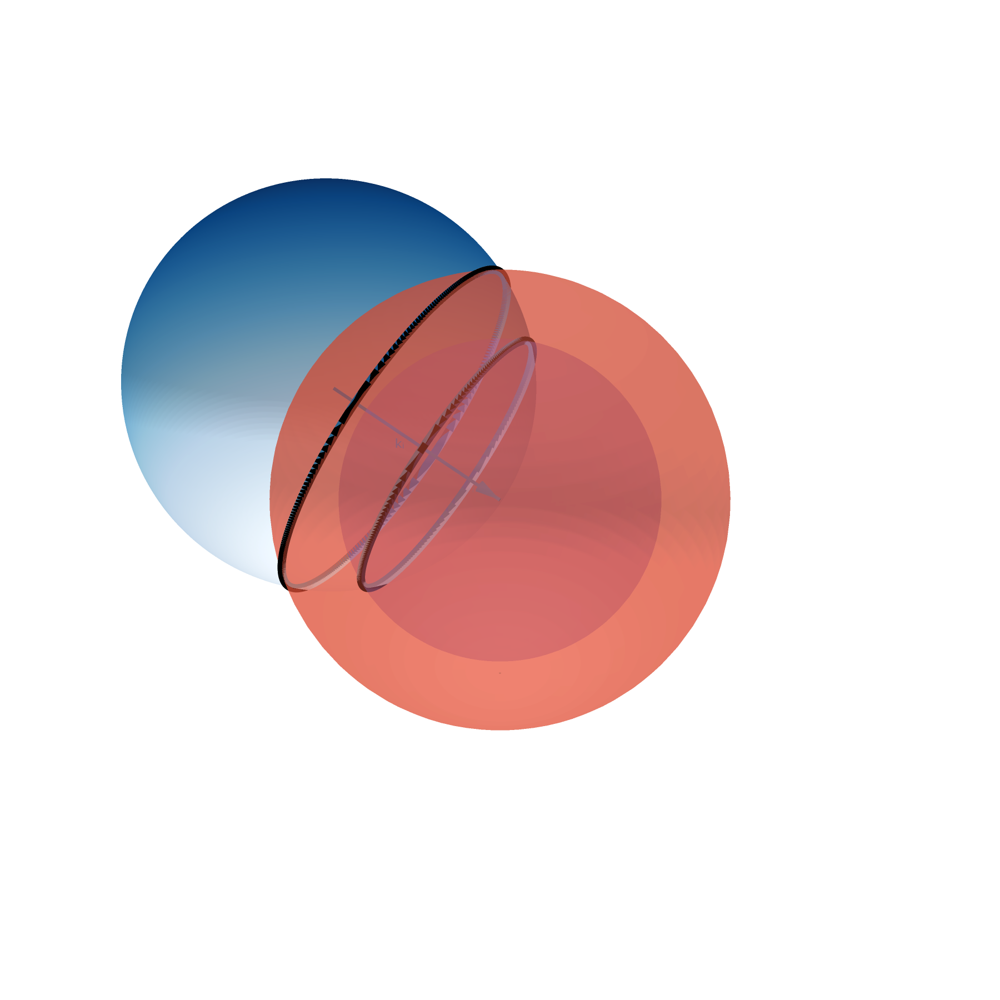
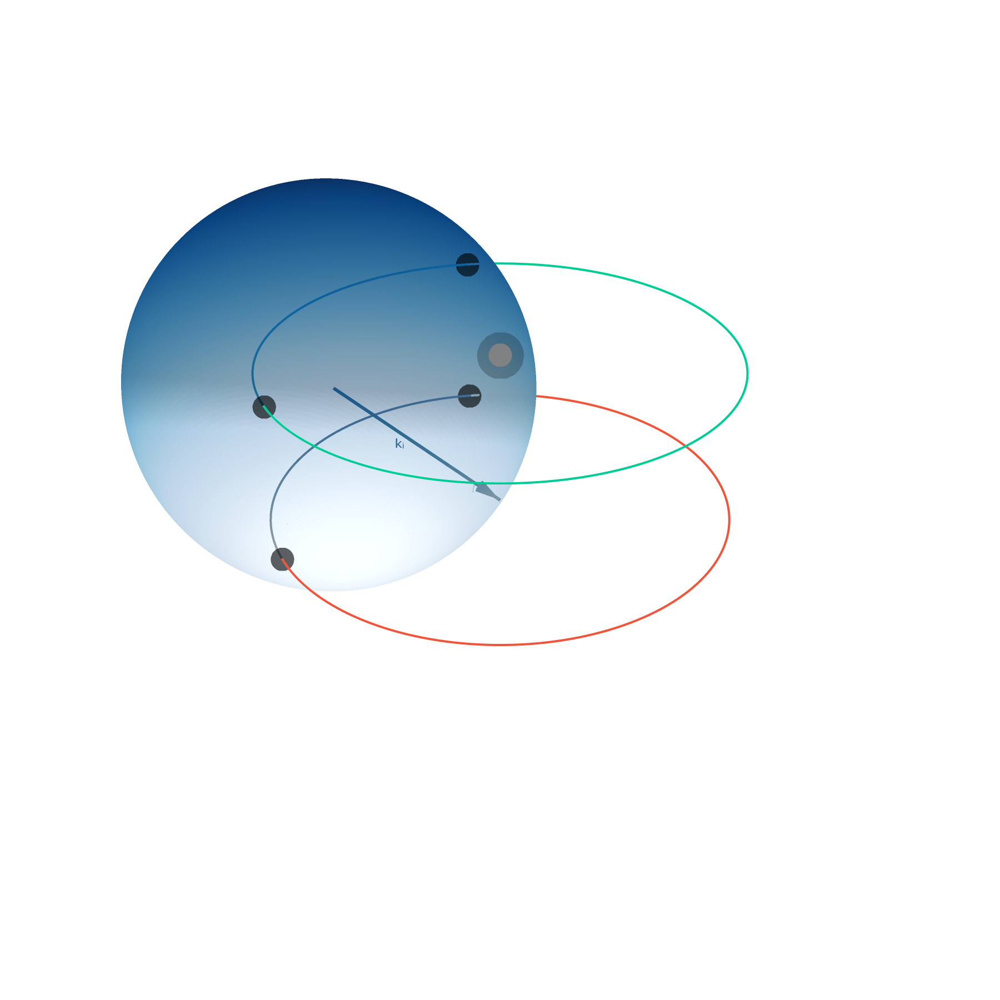
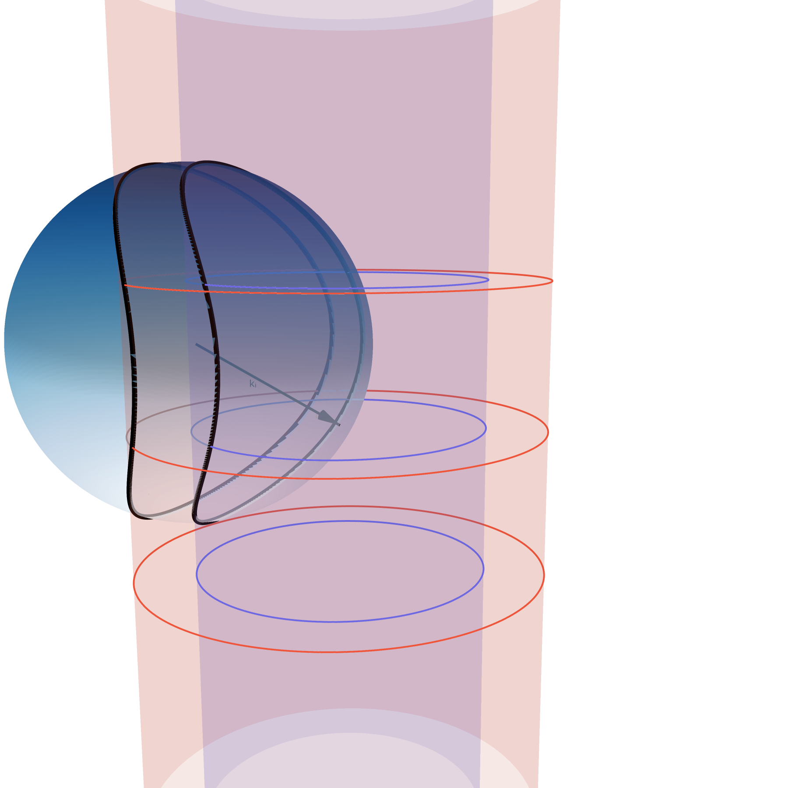
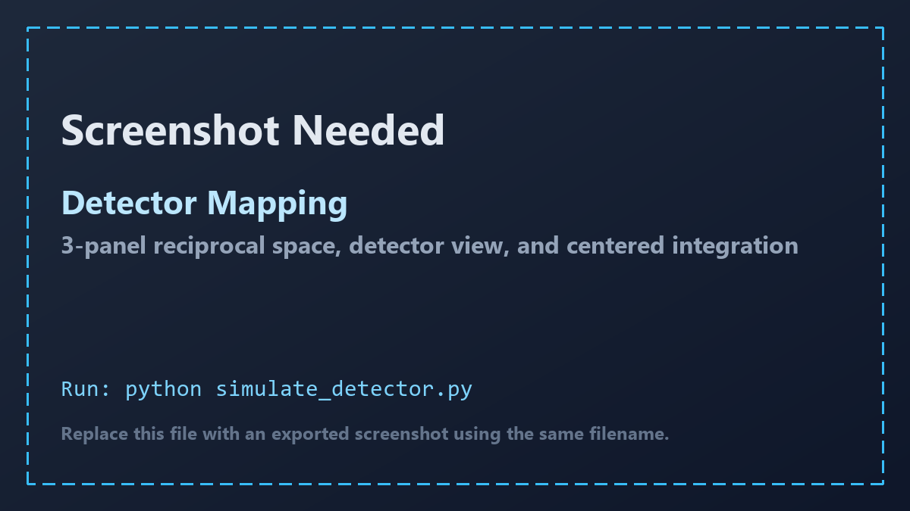
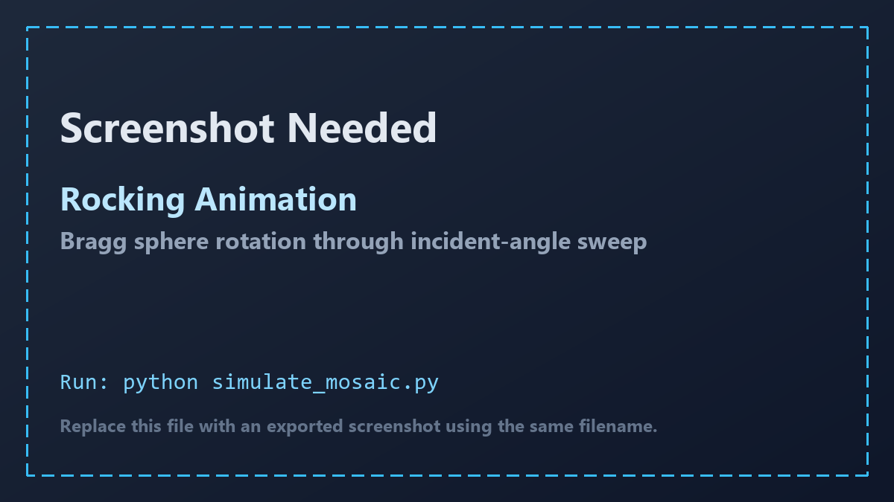
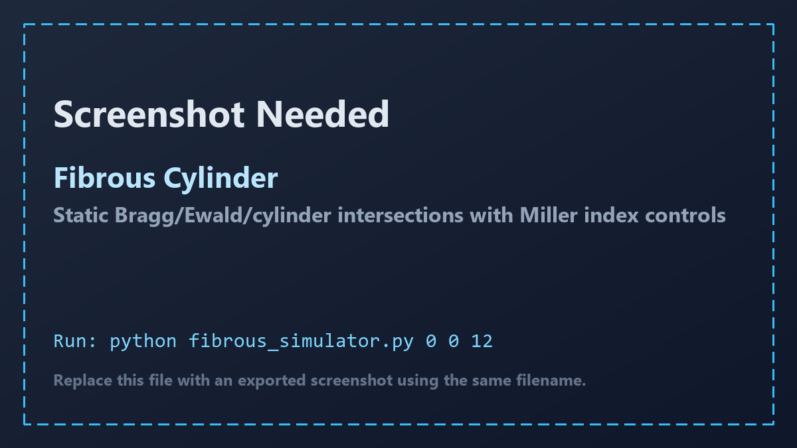
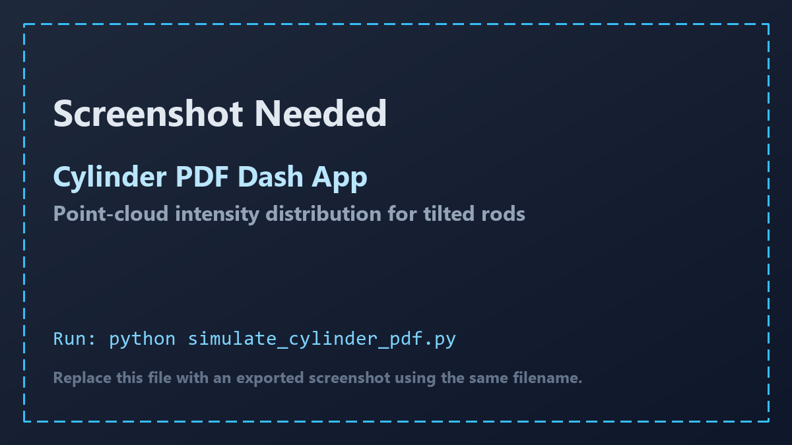
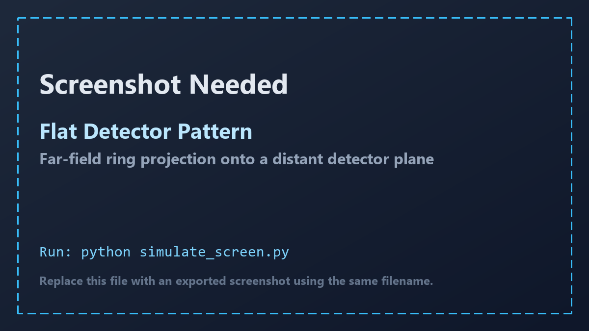

# 2D Mosaic Simulation

Interactive tools for visualizing how reciprocal-space features intersect the Ewald sphere and map onto detector-space observables for layered or mosaic materials.

## Current PNG Gallery (`docs/images`)

All current PNG assets in `docs/images` are shown below so the README top matches what is in the repo right now.

### `docs/images/mono_cylinder` (captured from `mono_simulator.py`)

| Single Crystal | 3D Powder |
| --- | --- |
|  |  |
| 2D Powder | Cylinder |
|  |  |

### Mono/Cylinder mode explanations

1. `Single Crystal`: Discrete reciprocal-lattice points. You only get scattering when a point lies on the Ewald sphere.
2. `3D Powder`: Lattice points are azimuthally averaged into full spherical shells (`|G|` constant), producing full rings when intersected.
3. `2D Powder`: In-plane averaging with out-of-plane order gives reciprocal rings (`|G_r|` at fixed `G_z`), producing ring-arc behavior.
4. `Cylinder`: Reciprocal features extend continuously along `qz`, modeling rod-like scattering from layered/fibrous order.

### `docs/images/placeholders` (PNG placeholders to replace with real screenshots)

These are intentionally temporary images. Keep the same filenames when you replace them with real captures.

### Detector Mapping (`simulate_detector.py`)



- File: `docs/images/placeholders/detector_placeholder.png`
- Purpose: 3-panel view linking reciprocal-space geometry to detector intensity and centered integration traces.
- What to capture: Full figure with all three panels visible, including colorbar and integration subplot.
- Run: `python simulate_detector.py`

### Rocking Animation (`simulate_mosaic.py`)



- File: `docs/images/placeholders/rocking_placeholder.png`
- Purpose: Shows Bragg-sphere rotation over rocking angle `theta_i`, with mosaic-intensity coloring.
- What to capture: A frame where ring intersection and angle annotation are both easy to see.
- Run: `python simulate_mosaic.py`

### Fibrous Cylinder (`fibrous_simulator.py`)



- File: `docs/images/placeholders/fibrous_placeholder.png`
- Purpose: Static Bragg/Ewald/cylinder intersection view with Miller-index control from CLI arguments.
- What to capture: A frame showing all three overlap curves clearly (`Ewald/Bragg`, `Cylinder/Ewald`, `Cylinder/Bragg`).
- Run: `python fibrous_simulator.py 0 0 12`

### Cylinder PDF Dash App (`simulate_cylinder_pdf.py`)



- File: `docs/images/placeholders/pdf_placeholder.png`
- Purpose: Point-cloud probability/intensity distribution for tilted rods with interactive parameter controls.
- What to capture: Graph and input controls (range slider + `x0`, `y0`, `sigma_I`, `sigma_phi`) in one view.
- Run: `python simulate_cylinder_pdf.py`

### Flat Detector Pattern (`simulate_screen.py`)



- File: `docs/images/placeholders/screen_placeholder.png`
- Purpose: Projects reciprocal-space ring intersections onto a distant planar detector (`y = det_y`).
- What to capture: Detector pattern with axes and intensity colorbar visible.
- Run: `python simulate_screen.py`

## Installation

The project targets Python `3.11+`.

```bash
pip install -e .
```

## Usage

Run scripts from the project root:

```bash
python mono_simulator.py                    # interactive mono + mode switcher
python mono_simulator.py --full-quality     # higher quality render profile
python simulate_detector.py                 # detector mapping view
python simulate_mosaic.py                   # rocking animation
python fibrous_simulator.py 0 0 12          # fibrous cylinder geometry
python simulate_cylinder_pdf.py             # Dash cylinder PDF app
python simulate_screen.py                   # flat detector projection
```

Installed console entry points:

- `mosaic-detector`
- `mosaic-rocking`
- `mosaic-cylinder`
- `mosaic-cylinder-pdf`
- `mosaic-screen`
