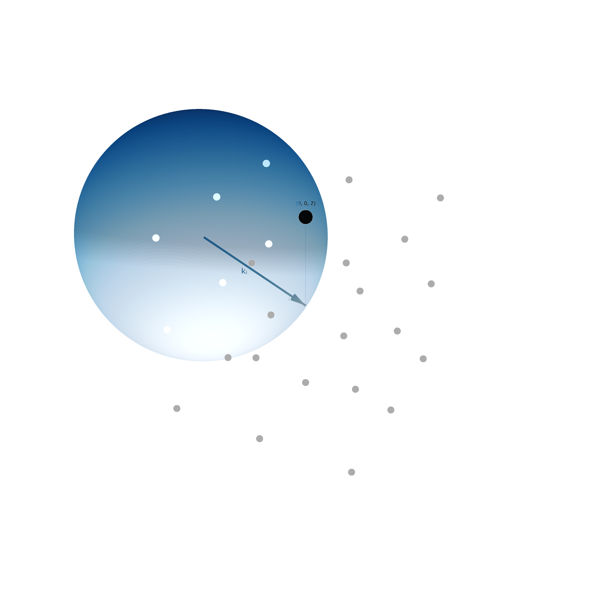
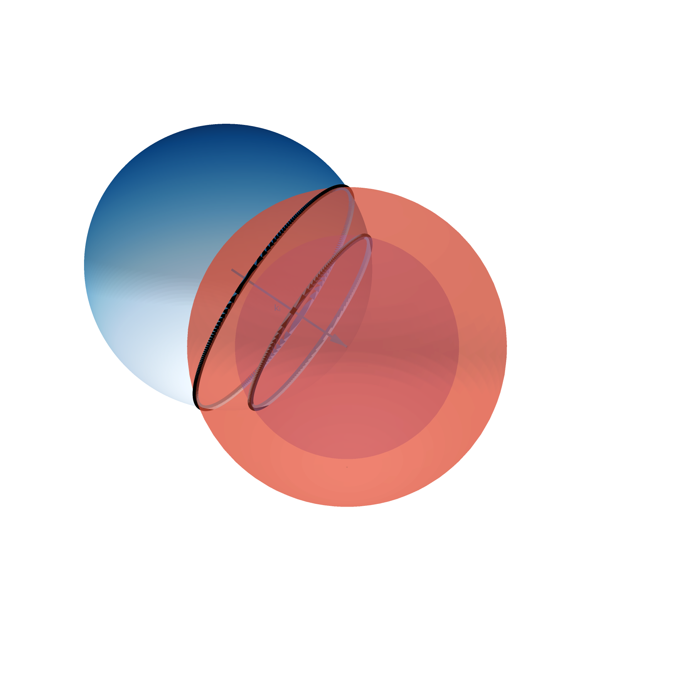
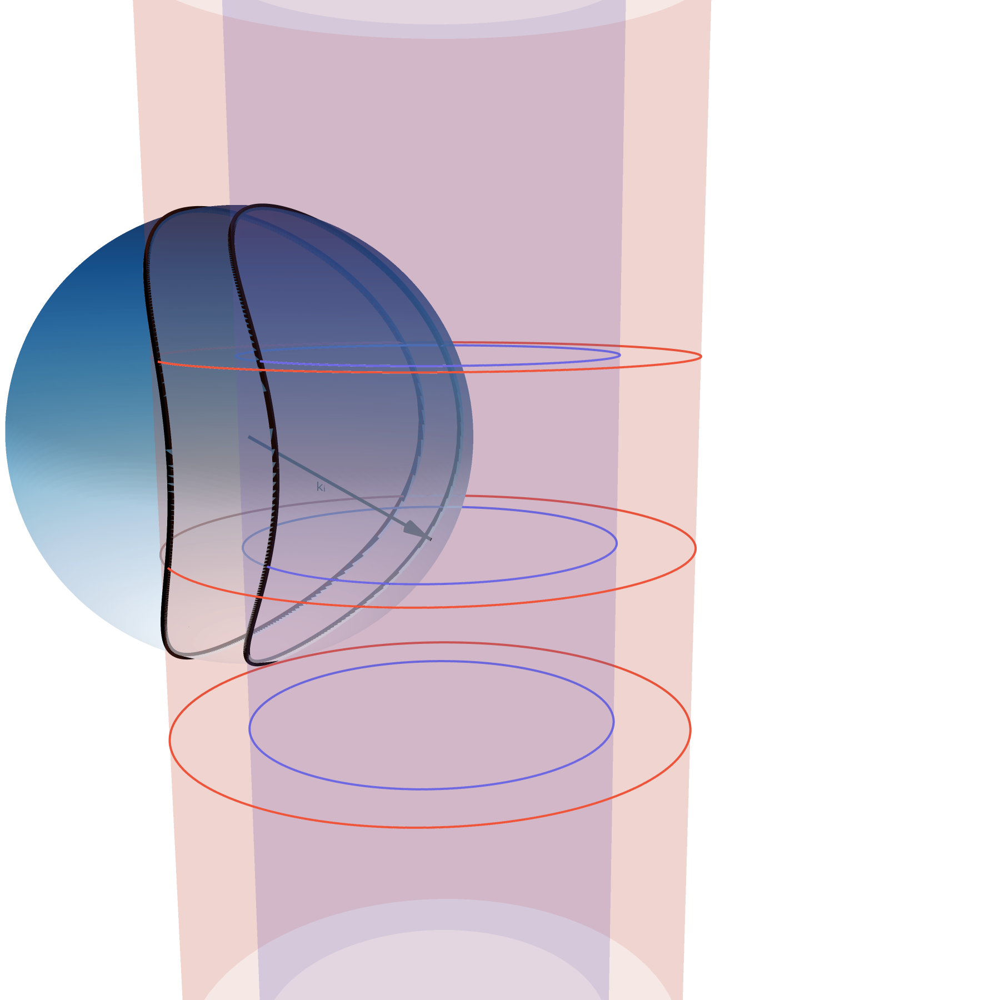
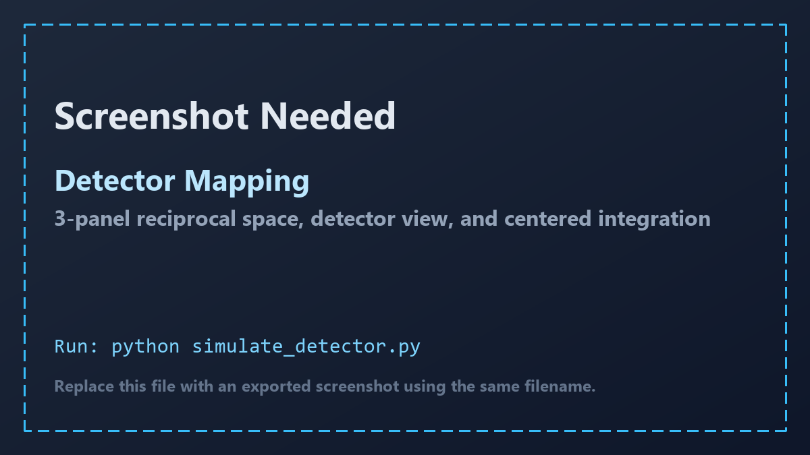
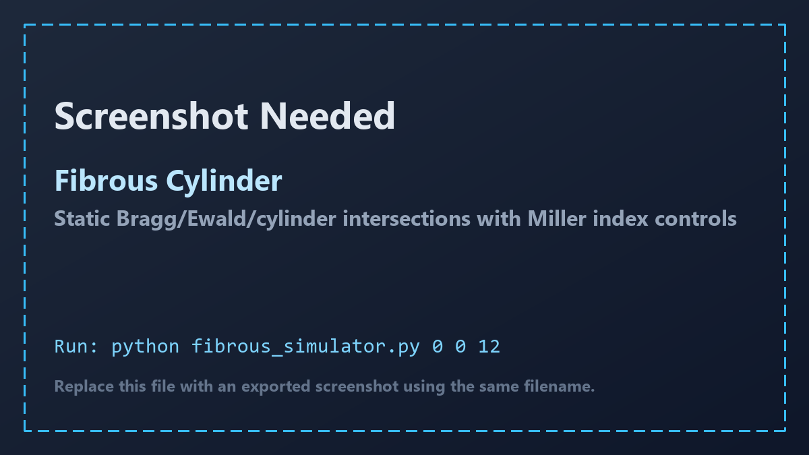

# 2D Mosaic Simulation

Interactive tools for visualizing how reciprocal-space features intersect the Ewald sphere and map onto detector-space observables for layered or mosaic materials.

## Current PNG Gallery (`docs/images`)

All current PNG assets in `docs/images` are shown below so the README top matches what is in the repo right now.

### `docs/images/mono_cylinder` (captured from `single_crystal_powder_cylinder_viewer.py`)

| Single Crystal | 3D Powder |
| --- | --- |
|  |  |
| 2D Powder | Cylinder |
|  |  |

### Reciprocal-space mode explanations

1. `Single Crystal`: Discrete reciprocal-lattice points. You only get scattering when a point lies on the Ewald sphere.
2. `3D Powder`: Lattice points are azimuthally averaged into full spherical shells (`|G|` constant), producing full rings when intersected.
3. `2D Powder`: In-plane averaging with out-of-plane order gives reciprocal rings (`|G_r|` at fixed `G_z`), producing ring-arc behavior.
4. `Cylinder`: Reciprocal features extend continuously along `qz`, modeling rod-like scattering from layered/fibrous order.

### `docs/images/placeholders` (PNG placeholders to replace with real screenshots)

These are intentionally temporary images. Keep the same filenames when you replace them with real captures.

### Detector Mosaic/Ewald View (`detector_mosaic_ewald_view.py`)



- File: `docs/images/placeholders/detector_placeholder.png`
- Purpose: 3-panel browser UI linking reciprocal-space geometry to detector intensity and centered integration, with live `theta_i`, HKL, `σ`, `Γ`, and `η` controls in the GUI.
- What to capture: Full figure with all three panels visible, including colorbar, integration subplot, and the `theta_i` control.
- Run: `python detector_mosaic_ewald_view.py 0 0 12 --sigma 0.8 --gamma 5 --eta 0.5`
  The CLI values seed the initial browser state; you can then change HKL and the mosaic parameters directly in the GUI.

### Fibrous Bragg/Ewald Intersections (`fibrous_bragg_ewald_intersections.py`)



- File: `docs/images/placeholders/fibrous_placeholder.png`
- Purpose: Browser-based Bragg/Ewald/cylinder intersection view with live HKL / `σ` / `Γ` / `η` controls below the plot.
- What to capture: A frame showing all three overlap curves clearly (`Ewald/Bragg`, `Cylinder/Ewald`, `Cylinder/Bragg`).
- Run: `python fibrous_bragg_ewald_intersections.py 0 0 12 --sigma 0.8 --gamma 5 --eta 0.5`
  The CLI values seed the initial browser state; you can then change HKL and the mosaic parameters directly in the GUI.

## Installation

The project targets Python `3.11+`.

```bash
pip install -e .
```

## Usage

Run scripts from the project root:

```bash
python mosaic_simulator.py                                          # unified GUI for the supported simulations
python single_crystal_powder_cylinder_viewer.py                # single-crystal / 3D powder / 2D powder / cylinder views
python single_crystal_powder_cylinder_viewer.py --full-quality # higher quality render profile
python detector_mosaic_ewald_view.py 0 0 12 --sigma 0.8 --gamma 5 --eta 0.5  # launches the detector Dash UI with live HKL/mosaic controls
python fibrous_bragg_ewald_intersections.py 0 0 12 --sigma 0.8 --gamma 5 --eta 0.5  # fibrous Bragg/Ewald/cylinder GUI with live HKL/mosaic controls
```

The unified GUI includes these switchable modes in one Dash app:

- `Powder Views`
- `Mosaic View`
- `Ewald Cylinder`

Installed console entry points:

- `mosaic-simulator`
- `mosaic-single-crystal-powder-cylinder-viewer`
- `mosaic-detector-mosaic-ewald-view`
- `mosaic-fibrous-bragg-ewald-intersections`
